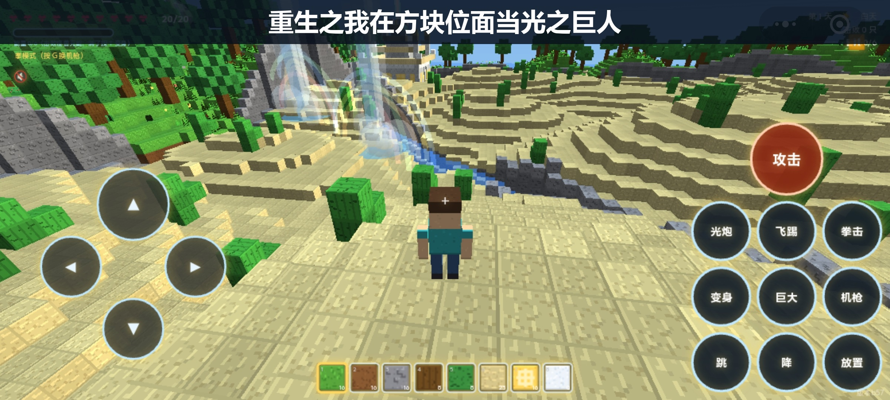
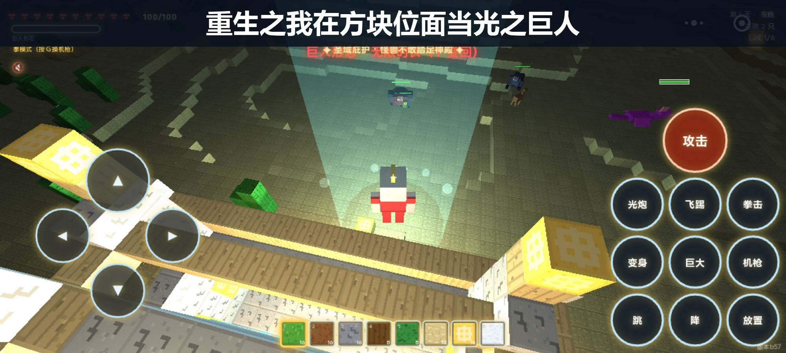
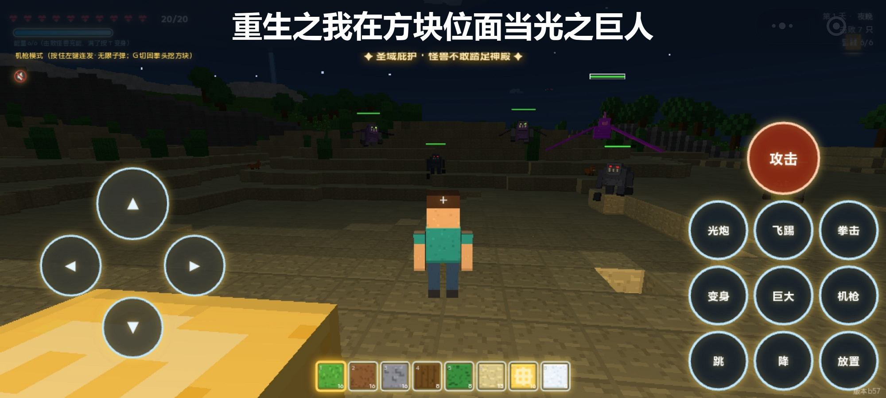
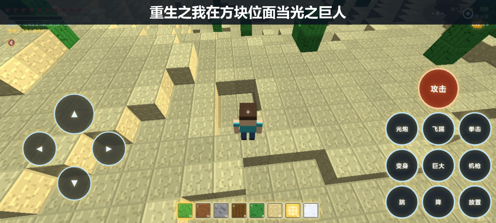

# 重生之我在方块位面当光之巨人（光之巨人 · 方块世界）

> 3D 体素沙盒生存游戏 —— 类我的世界方块世界 × 变身光之巨人打怪兽。
> **零外部素材**：贴图、角色、怪兽、音效全部由代码程序化生成，单文件即开即玩。



**巨人形态**（变身）｜**夜晚怪兽入侵**（守卫战）｜**挖掘建造**（沙盒玩法）

|  |  |  |
|---|---|---|
| 变身光之巨人 | 夜晚 Boss 降临 | 自由挖掘建造 |

---

## 🌐 在线游玩（GitHub Pages）

**电脑浏览器直接玩**：<https://liuzhiqiang23.github.io/light-giant/>

> 无需安装任何东西，鼠标 + 键盘操作。本地运行方式见下方「快速开始」。

## ✨ 特性亮点

- 🌍 **512×512 多生物群系世界**：草原、沙漠（仙人掌）、密林、雪山山脉、贯穿全图的河流、沙滩海洋
- 🏰 **宏伟神殿 + 天堂岛链**：地面神殿自带圣域结界与传送光阵；y≈86 浮空天堂岛（云鹿、独角兽、凤凰栖息）
- 🌊 **天堂瀑布**：上界引水直落地面，半透明水柱 + 彩虹拱 + 入夜自发光
- 🦖 **怪兽生态**：4 种小怪变体 + 3 种夜间 Boss（巨型兽 / 飞翼龙 / 岩石魔像）+ 每 5 夜超级巨兽王（300 血）
- ⚡ **巨人战斗系统**：能量炮弹、蓄力红激光、锁定飞踢、三连拳击、二次巨大化——全部带打击感三件套（顿帧 / 屏幕震动 / 体素碎片飞溅）
- 🛡 **圣域庇护**：神殿周围 22 格怪兽不敢踏足；**警戒系统**：击杀 6 只小怪后 Boss 才参战
- 🌅 **战损黎明复原**：夜晚轰碎的地形黎明自动复原（你亲手盖的房子永久保留）
- 🔊 **全程序化音效**：三层合成 + 主总线混响 + 动态压缩，机枪/能量炮/激光/爆炸各有音色
- 🎨 **逐实例环境光遮蔽**：86.9 万方块实例 60fps（分块渲染 + 双裁剪 + 点光池防卡顿）

## 🚀 快速开始

### 网页版（H5，零依赖）

```bash
# 方式一：Windows 双击
启动游戏.cmd          # 自动起本地服务器并打开浏览器

# 方式二：任意系统
python -m http.server 8930
# 浏览器打开 http://127.0.0.1:8930
```

> 无构建步骤、无外部 CDN 依赖（three.js r128 已本地化），克隆即玩。

### 微信小游戏版

`minigame/` 目录为微信小游戏移植版（触屏虚拟摇杆 + 按钮操控）：

1. 下载[微信开发者工具](https://developers.weixin.qq.com/miniprogram/dev/devtools/download.html)
2. 导入项目，选择 `minigame/` 目录，AppID 使用自己的小游戏 AppID
3. 编译预览即可体验

## 🎮 操作说明（网页版）

| 按键 | 作用 |
|---|---|
| W A S D | 移动 |
| 鼠标 | 转视角（点击画面锁定鼠标，Esc 释放） |
| 空格 | 跳跃 / 巨人飞行上升 |
| Shift | 疾跑 |
| 左键 | 人类：破坏方块 / 攻击；巨人：锁定准星命中的区域/怪兽（70 格内） |
| 右键 | 放置方块 |
| G | 切换 拳头 ⇄ 机关枪（无限子弹） |
| T | 变身/变回 光之巨人（满 6 能量解锁） |
| F | **点按**：黄色能量炮弹（冲击波 + 击退 + 轰坑）；**长按 2 秒**：红色双手蓄力激光（持续 14 伤） |
| V | **锁定飞踢**（先左键锁定）：点按=快速飞踢（45 伤 + 爆炸）；蓄力 1.5 秒=穿透飞踢（路径全程 45 伤 + 终点大爆炸 60 伤） |
| R | 拳击三连段：刺拳 8 → 勾拳 10 → 上勾重拳 18（顿帧慢放 + 击飞） |
| B | 巨大化：体型 ×3.2，拳击伤害 ×1.6（再按解除） |
| 空格 / C | 巨人飞行：上升 / 下降 |
| 数字键 1-8 | 选方块 |
| M | 静音开关 |

## 🌏 世界与玩法循环

1. **白天**：自由采集、建造、逗兔子和鹿；走进神殿传送光阵站定 2 秒 → 升上天界圣殿
2. **夜晚**：怪兽成群进攻——待在神殿圣域内可安全防御（金光「✦ 圣域庇护」提示）；主动出击击败怪兽攒能量
3. **Boss 降临**：乌云聚集 + 三道闪电劈落；Boss 遵守警戒系统（击杀 6 只小怪才参战），蓄能放光束时出现红色方向警报箭头
4. **黎明**：战损地形全部复原 + 治愈光尘；满 6 能量按 T 变身光之巨人（银红涂装 + 发光眼 + 冲天光柱变身特效）

### 怪兽图鉴

| 变体 | 特征 |
|---|---|
| 潜行者 stalker | 暗灰长臂、红眼，爪子垂地 |
| 疾行者 runner | 枯绿弓身、橙眼，速度快 |
| 装甲兽 brute | 暗红宽体肩甲背板、绿眼，血厚（击杀+2能量） |
| 飞翼兽 wing | 暗紫膜翼、荧光绿眼，飞行俯冲 |
| 巨型 Boss | 紫色巨兽，45 血，远程光束 |
| 岩石魔像 | 80 血重甲绿芯 |
| 超级巨兽王 | 深红背刺，300 血 8 伤害，每第 5 夜降临（你不惹它，它不动手） |

## 🛠 技术实现

- **three.js r128**（本地化，无 CDN）；单文件 `index.html`，无构建步骤
- **分块渲染**：32×32 区块 ×64，每帧最多重建 2 块 + 视锥/距离双裁剪，89 万实例 60fps
- **程序化值噪声地形**（Math.imul 精确 32 位 hash）+ 岛屿衰减 + 天堂岛链
- **Canvas 程序化 16×16 贴图**：草尖/石纹裂纹/木节/沙波纹/雪晶闪光逐像素绘制，mipmap 近锐远柔
- **逐实例环境光遮蔽**：顶盖 +3、四侧 +1 折算暗度写入 InstancedMesh 逐实例顶点色
- **天空系统**：着色器渐变穹顶 + 太阳/月亮圆盘升落 + 夜间星空，雾色实时同步
- **战损复原**：入夜 `vox.slice()` 快照，黎明逐格 diff 回写 + 只重建受影响区块
- **性能防线**：常驻点光池（6 盏，避免着色器重编译卡帧）、特效网格池化、粒子池饱和降级、帧循环复用临时向量压 GC
- **音效**：全程序化合成（低频垫底 + 中频主体 + 高频脆头三层式），主总线统一混响 + 压缩

## 📁 项目结构

```
├── index.html          # H5 完整游戏（单文件，含全部逻辑/贴图/音效）
├── three.min.js        # three.js r128 本地副本
├── 启动游戏.cmd         # Windows 一键启动（本地服务器 + 自动开浏览器）
├── screenshots/        # 游戏截图
└── minigame/           # 微信小游戏移植版
    ├── game.js         # 小游戏入口（适配层装配）
    ├── game-code.js    # 游戏主体逻辑（与 index.html 同源）
    ├── adapter.js      # DOM→微信小游戏适配层
    ├── hud.js          # 触屏 HUD（虚拟摇杆 + 技能按钮）
    ├── game.json       # 小游戏配置（横屏）
    ├── project.config.json
    └── libs/three.min.js
```

## 📝 开发笔记

- 平移自 H5 原型：渲染/世界/实体逻辑同源，`adapter.js` 把 DOM/Web Audio 适配为微信小游戏 API
- 触屏方案：左侧虚拟摇杆移动 + 右侧动作按钮（攻击/跳跃/变身/技能）
- TODO：区块合并网格 + 纹理图集（当前每区块 7-10 种方块类型各一个 InstancedMesh，合并后远景帧率可再提升）

## 📄 许可证

[MIT](LICENSE) © 柳志强（Alvis）
